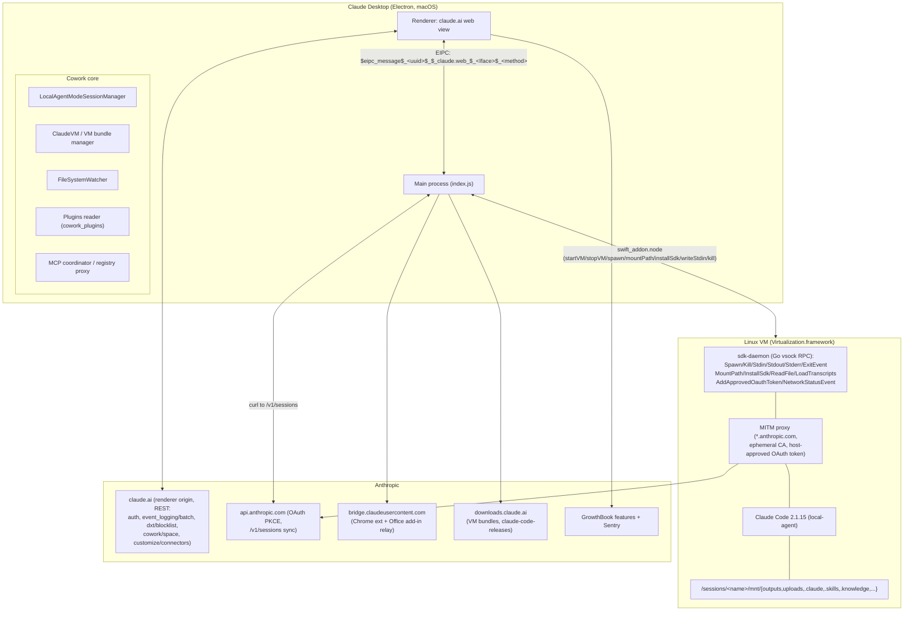

# Reverse Engineering — Claude Cowork (Claude Desktop 1.1.673)

> Generated: 2026-08-06 | Session: cowork RE campaign | Tags: cowork, reverse-engineering, claude-desktop, vm, eipc
> Method: static RE of extracted `app.asar` (main bundle `index.js` 3.3 MB, byte-offset cited) + VM rootfs forensics (debugfs on `rootfs.img`) + community RE (johnzfitch/claude-cowork-linux) + Agent SDK types + endpoint probing
> Raw material: `/tmp/opencode/deepresearch/cowork_app_re-M3KQ/` (symbol-map, session-lifecycle, vm-layer, cloud-bridge, security-model, claude-code-binary, web-endpoints-community)

## TL;DR — how Cowork operates

- **Cowork is a mode inside Claude Desktop, not a separate app.** Electron main process + claude.ai web renderer, glued by an EIPC channel (`$eipc_message$_<buildUUID>_$_claude.web_$_<Interface>_$_<method>`).
- **The agent kernel is Claude Code 2.1.15** (Bun standalone binary, "local-agent" entrypoint), running **inside a Linux VM** (Apple Virtualization.framework on macOS). The desktop app = orchestrator; claude.ai renderer = UI + auth.
- **The VM is a "thin" sandbox**: rootfs ships only tooling (Node 22, Python/doc stack, LibreOffice); the Claude Code binary + OAuth token are injected at boot over a vsock RPC bridge (`sdk-daemon`), and it runs a **MITM proxy** so the in-VM binary talks to `*.anthropic.com` with a host-approved OAuth token.
- **Host ↔ VM contract**: per-session bind mounts at `/sessions/<vmProcessName>/mnt/{outputs,uploads,.claude,.skills,.knowledge,<user folders>}`; path validation on both sides; deletion requires explicit mount upgrade `rw`→`rwd`.
- **Two execution models** (July 2026 pivot): local (this architecture) and cloud (sandbox on Anthropic servers; desktop becomes a bridge — the desktop↔cloud channel is renderer-side, not in the main bundle).
- **Scheduled tasks, spaces, memory, connectors are all EIPC surfaces** driven from the web renderer — the main process is their local executor.

---

## 1. Architecture



### Key components (with byte offsets in `index.js`)

| Component | Symbol | Region | Role |
|---|---|---|---|
| Session manager | `f0e` / `LocalAgentModeSessionManager` | 2904399–2946600 | Owns session lifecycle, VM process, mounts, permissions |
| Session IPC iface | `ry` / `LocalAgentModeSessions` | 142229 | 28+ methods (start, getTranscript, setMcpServers, mcpCallTool, respondToToolPermission, getSessionsForScheduledTask, 12× `*Bridge*`…) |
| VM control iface | `y0` / `ClaudeVM` | 176234 | isSupported, startVM, download, deleteAndReinstall, getRunningStatus… |
| SwiftVM loader | `Uye`/`_i` | 2850032 | `import("@ant/claude-swift")`, cached module handle |
| VM process abstraction | `_Qe` | 2850654 | stdin buffering until spawn confirmed → `writeStdin`; SIGTERM/SIGKILL |
| VM start sequence | — | 2863158 | Step 2/4 swift API → 3/4 startVM(memoryGB) → 4/4 guest poll (60 s) → installSdk |
| VM event callbacks | `Vye`/`bQe` | 2853078 | stdout/exit/error/networkStatus; guestConnectionChanged → SIGKILL processes on unexpected disconnect |
| VM bundle manager | — | 2859795 | rootfs.img download/checksum/warm/upgrade |
| Claude Code SDK mgr | — | 1917378 | pins version, downloads, verifies sha256 |
| Directory tool | `GQe` | 2872549 | `request_cowork_directory` → dialog → `mountPath("rw")` |
| Deletion tool | — | 2874700 | `allow_cowork_file_delete` → `mountPath("rwd")` |
| Uploads staging | `Xie` | 2903666 | md5 dedup, hardlink, home-only |
| Path validation | `est` | 3283374 | 5-stage: `local_` → `/sessions/<name>/` → bind → normalize → blocklists |
| Session IPC impl | `Wat` | 3277169 | start/sendMessage/stop/archive |
| VM IPC impl | `Zat`/`Yat` | 3280640 | handleCoworkVMApi, cleanupVMBundleIfUnsupported |

## 2. Session lifecycle (end-to-end)

```mermaid
sequenceDiagram
    participant UI as claude.ai renderer
    participant M as Main process
    participant SDK as Agent SDK 0.2.15
    participant SW as swift_addon
    participant VM as Linux VM (sdk-daemon)
    participant API as api.anthropic.com

    UI->>M: startSession(message, mcpServers, folders, KBs…)
    M->>M: create record local_&lt;uuid&gt;, vmProcessName &lt;adj&gt;-&lt;adj&gt;-&lt;scientist&gt;
    M->>M: persist &lt;userData&gt;/local-agent-mode-sessions/&lt;acct&gt;/&lt;org&gt;/&lt;id&gt;.json
    M->>API: OAuth (cache → refresh → PKCE clientId 9d1c250a…)
    M->>M: sync skills/plugins/projects (parallel); resolve KBs
    M->>SW: ensure VM bundle → startVM(memoryGB)
    SW->>VM: boot rootfs (60 s guest poll)
    M->>SW: installSdk(claude-code 2.1.15 → /usr/local/bin/claude)
    M->>SDK: query() { spawnClaudeCodeProcess → vm.spawn }
    SDK->>VM: spawn(id, processName, claude, [--resume, --output-format stream-json …], mounts, CLAUDE_CODE_OAUTH_TOKEN)
    VM->>API: Claude Code ⇄ MITM proxy (host-approved OAuth token)
    loop turns
        VM->>M: stream-json events (tool_use, text…)
        M->>UI: session events + tool_permission_request
        UI-->>M: respondToToolPermission(allowOnce/always/deny)
        M->>VM: writeStdin (user message, paths rewritten host→VM)
    end
    VM->>M: result event (num_turns, is_error)
    M->>SW: kill(vmProcess) SIGTERM
    M->>M: saveSession (fsDetectedFiles…); FileSystemWatcher stops
```

- **Creation**: `local_<uuid4>`; `vmProcessName` = docker-style `<adj>-<adj>-<scientist>` (≤32 chars); session JSON persisted **before** VM boots; first user message buffered.
- **Init steps** (telemetry `lam_session_initialization_*`): `auth → skills → prompt → mcp_setup → query → complete`; system-prompt `{{placeholder}}` substitution (e.g. the folder-picker hint is rewritten to "use the request_cowork_directory tool").
- **Agent spawn**: SDK `query()` with custom `spawnClaudeCodeProcess`; env: `CLAUDE_CONFIG_DIR=/sessions/<vm>/mnt/.claude`, `CLAUDE_CODE_ENTRYPOINT=local-agent`, `CLAUDE_CODE_DISABLE_BACKGROUND_TASKS=1`, `MCP_TOOL_TIMEOUT=30000`, `CLAUDE_CODE_OAUTH_TOKEN` (via `Dye()`), `CLAUDE_CODE_ALLOW_MCP_TOOLS_FOR_SUBAGENTS=true`. Host-side "process" is a fake child (PassThrough stdin); the real process runs in-VM via the daemon.
- **Tool allowlist**: Task, Bash, Glob, Grep, Read, Edit, Write, NotebookEdit, WebFetch, TodoWrite, WebSearch, Skill + `mcp__mcp-registry__search_mcp_registry`, `mcp__mcp-registry__suggest_connectors`, `mcp__cowork__create_knowledge_base`. PreToolUse hook blocks `run_in_background` (background agents disabled).
- **Turn end**: `result` event → watcher stop → VM process SIGTERM. `stopSession` = interrupt → inputStream.done() → SIGTERM; `archiveSession` deletes uploads only, marks archived; app quit stops the VM.

## 3. The VM layer

### Guest OS (from `rootfs.img` forensics — Ubuntu, built 2026-01-15)
- Ubuntu (debian_version), systemd, snap; `/workspace` (uid 1000) empty in image — created at runtime.
- **Baked in**: Node **v22.22.0**, `srt` (`@anthropic-ai/sandbox-runtime` 0.0.28), `sandbox-helper`, **`sdk-daemon`** (systemd service, Go vsock bridge), uv + Python doc stack (markitdown, camelot, pdfplumber, LibreOffice), npm globals.
- **NOT baked in**: Claude Code — installed at boot via `installSdk` → sdk-daemon copies it from the host share to `/usr/local/bin/claude` (v2.1.15, linux-arm64, sha256 `20a52025…`, source `downloads.claude.ai/claude-code-releases`).
- **Mount model**: `/sessions/` created at runtime; sdk-daemon creates `/sessions/<name>/mnt/<mountName>` per process, bind-mounting host dirs (outputs, uploads, user folders, `.knowledge/<id>`, shared cwd `~/Documents/Claude`); persistence via per-session **virtio NVMe disks formatted ext4** by the daemon.
- **VM bundle**: `~/Library/Application Support/Claude/vm_bundles/claudevm.bundle/rootfs.img` (10 GB, GPT: EFI @2048 + Linux ext4 @206848, hash `8c56966f…`); lifecycle: download → zst decompress → checksum validate → `[warm]` fetch hash per app version → upgrade on mismatch → dev-menu delete/reinstall.

### sdk-daemon RPC surface (vsock)
`Spawn, Kill, Stdin, Stdout, Stderr, ExitEvent, MountPath, InstallSdk, IsRunning, ReadFile, LoadTranscripts, AddApprovedOauthToken, NetworkStatusEvent`
- **MITM proxy** at `/var/run/mitm-proxy.sock`: ephemeral CA installed into guest trust store; intercepts `*.anthropic.com`; requires the host-approved OAuth bearer token → in-VM Claude Code cannot reach Anthropic without host consent.

## 4. Security model

| Layer | Enforcement | Evidence |
|---|---|---|
| Path validation | 5-stage fail-fast: `local_` prefix → `/sessions/<name>/` shape → vmProcessName bind → posix-normalize containment → blocklist | `est` @3283374 |
| Extension blocklists | `vbe` (open): `.exe .com .msi .bin .app .dmg .pkg .jar`; `tst` (open-file): `.sh .bash .zsh .command .bat .cmd .ps1 .vb .jnlp .js .pl .py .rb .scpt .scptd .applescript .workflow` | @3283374 |
| Folder grants | `request_cowork_directory`: realpath-vs-realpath **home confinement** (Qye), `mountPath("rw")`, persisted `userSelectedFolders` | @2872549 |
| Deletion | default `rw` ⇒ `rm` fails EPERM in VM; `allow_cowork_file_delete` → `mountPath("rwd")` + per-mount approval persisted in session JSON (honored across respawns) | @2874700, @2924083 |
| Uploads | md5-content dedup (hash-suffix rename), hardlink staging, home-only via realpath+lstat, `ro` mount, message path rewrite | @2903666 |
| Permissions | SDK `canUseTool` → `tool_permission_request` → renderer dialog → `deny/once/always`; full `audit.jsonl` trail; `sessionBypassPermissionsMode`/`sessionTrustAccepted` exist as SDK defaults, **never enabled** by the app | @2913082 |
| Network | `egressAllowedDomains` passed at spawn; MITM proxy with approved token; session-scoped creds | VM layer |
| Connector tokens | never enter VM; connector calls server-side (`claudeai-proxy` MCP type routes them) | cloud bridge |
| Knowledge bases | `create_knowledge_base` tool (injected externally, `null` in this bundle); KBs mounted **rw** at `/mnt/.knowledge/<name>` + watched — flagged gap: no in-bundle gate on the rw mount | security-model.md |
| Host↔VM boundary | mounts matrix `ro/rw/rwd` enforced by native SwiftVM; seccomp visible only in error classifier (not in JS) | vm-layer.md |

## 5. Cloud bridge, IPC & endpoints

### EIPC surface (362 methods; namespace `claude.web`)

| Interface | # | Highlights |
|---|---|---|
| `LocalAgentModeSessions` | 28+ | start, getTranscript, shareSession, setMcpServers, replaceRemoteMcpServers, mcpCallTool, respondToToolPermission, syncSkills, respondDirectoryServers, respondPluginSearch, getSessionsForScheduledTask, openOutputsDir, 12× `*Bridge*` |
| `CoworkSpaces` | 21 | getAllSpaces, createSpace, addFolderToSpace, copyFilesToSpaceFolder, readFileContents, classifySessions, onSpaceEvent |
| `ClaudeVM` | 10 | isSupported, startVM, download, deleteAndReinstall, apiReachability |
| `CoworkScheduledTasks` | 9 | createScheduledTask, updateScheduledTask(+FileContent, +Status), removeApprovedPermission, clearChromePermissions, getAllScheduledTasks |
| `CCDScheduledTasks` | 8 | same minus clearChromePermissions |
| `CoworkMemory` | 2 | readGlobalMemory / writeGlobalMemory — shared memory store (same one the MS-365 add-in reads) |
| misc | — | Account, Auth(doAuthInBrowser), AppFeatures(setIsDxtAutoUpdatesEnabled), ChromeExtension(installExtension…), ComputerUseTcc (TCC grants), BuddyBleTransport (BLE device pairing) |

### Server endpoints (verified from code)

| Endpoint | Purpose |
|---|---|
| `wss://bridge.claudeusercontent.com/chrome/<userId>` (+`-staging`) | Chrome-extension relay: `connect`(oauth_token) / `tool_call` / `permission_request` / `routing_ack` (reports `extension_sockets`/`mcp_sockets` counts) / `tool_result`; dev `ws://localhost:8765` |
| `https://api.anthropic.com/v1/sessions[/{id}][/events]` | remote session sync (create with cwd/localSessionId/model/permissionMode/title/userSelectedFolders/organizationUuid; beta `oauth-2025-04-20,ccr-byoc-2025-07-29`; device binding `DeviceRegistry.signCreateSessionBind` required on newer builds) |
| `https://claude.ai` | renderer origin + REST: `/api/event_logging/batch` (x-service-name: claude_desktop), `/api/organizations/<org>/dxt/blocklist`, `/desktop/callback`, `/cowork/space/`, `/customize/connectors`, `/settings/integrations` |
| `https://downloads.claude.ai/vms/linux/` | VM bundle images |
| `https://downloads.claude.ai/claude-code-releases/<ver>/<platform>/claude` | CLI binary (sha256-verified vs embedded manifest; version pinned at build time) |
| `api.anthropic.com` OAuth | PKCE, clientId `9d1c250a-…`, sessionKey/lastActiveOrg cookies; tokens in `config.json` `oauth:tokenCache` (safeStorage/Keychain) |
| Telemetry | `POST claude.ai/api/event_logging/batch` + Sentry DSN `2f98127c…@o1158394.ingest.us.sentry.io` (preload, user.id=`ant-did` from `~/Library/Application Support/Claude/ant-did`) + GrowthBook `/api/desktop/features` |

### Connectors
- Desktop proxies registry search to the renderer (`directory_servers_search`, 10 s timeout); connector shape `{uuid, name, oneLiner, url, iconUrl, toolNames, isConnected}`.
- Cloud connectors flow into the agent loop as **`claudeai-proxy` MCP servers** (SDK type; auto-fetch opt-out flag exists). Server-side MCP connector: Messages API `mcp_servers` + `mcp_toolset` (beta header `mcp-client-2025-11-20`).
- Runtime calls observed: `…/sync/mcp/drive/*` (gdrive, tokens server-side), `…/mcp/servers/<uuid>/tools/call` (remote MCP); feature-gated by `enabled_bananagrams/foccacia/sourdough`.

### MCPB / DXT (misconceptions cleared)
- **MCPB = signed MCP-plugin bundle file** (`.mcpb`, `MCPB_SIG_V1`…`MCPB_SIG_END` wrapping PKCS#7 detached signature, cert-chain verified, `manifest.json` with `manifest_version` or legacy `dxt_version`) — local packaging, **not** a wire protocol.
- **DXT = "desktop extension"** — legacy manifest field + `.dxt` plugin file extension; auto-updates via `AppFeatures.setIsDxtAutoUpdatesEnabled`.

## 6. Scheduled tasks

- Stored locally: `.claude/scheduled_tasks/<id>.json`; renderer creates them (`CoworkScheduledTasks` EIPC); **creation is renderer-only**.
- Runs get auto-approved tools via `shouldAutoApprovePermission(scheduledTaskId, …)` gate.
- Server sync of scheduled tasks: **unverified** — no REST path found; execution model = local app trigger. (The July cloud pivot says scheduled tasks run server-side with no device online — but the mechanism is not in this bundle; it's a renderer/cloud concern.)

## 7. On-disk data model (this machine)

| Path | Contents |
|---|---|
| `~/Library/Application Support/Claude/` | app userData |
| `…/local-agent-mode-sessions/<account>/<org>/<sessionId>.json` | session records (uploads, userSelectedFolders, approved mounts, fsDetectedFiles) |
| `…/vm_bundles/claudevm.bundle/rootfs.img` (+`.rootfs.img.origin`) | VM image (hash `8c56966f…`) |
| `…/claude-code/<version>/claude` | app-managed Claude Code binary (darwin; VM flavor fetched at boot) |
| `…/config.json` | `oauth:tokenCache` (Keychain-encrypted), DXT allowlist cache (`dxt:allowlistCache:<uuid>`) |
| `…/ant-did` | device id |
| `~/.claude/cowork_settings.json` | cowork settings (`enabledPlugins`) — **not yet created on this machine** |
| `~/.claude/cowork_plugins/{installed_plugins.json, cache}` | plugins (scopes: user/project/local) |
| `~/.claude/scheduled_tasks/*.json` | scheduled task definitions |
| `~/Library/Logs/Claude/` | `main.log`, `cowork_vm_node.log`, `cowork_vm_swift.log` (debug), `claude_vm_node.log`, `mcp.log`, `sentry/` |
| Sessions dir (Linux port) | `~/.config/Claude/local-agent-mode-sessions/sessions/…` (symlink `/sessions`, 0700) |

## 8. Gaps — what's still unknown (needs live access)

1. **claude.ai REST** (`/api/cowork/*`, artifacts API, spaces API, connector fetch) — Cloudflare-gated; requires devtools capture from a logged-in session.
2. **Live VM behavior** — mount creation, sdk-daemon logs, MITM proxy operation, seccomp profile: unobservable until a real session runs.
3. **Scheduled-task server sync** — local vs cloud trigger path unverified.
4. **Private packages** — `@ant/claude-swift`, `@ant/claude-native`, `@ant/claude-for-chrome-mcp` (npm 404; the swift addon's full native surface is the VM/bridge contract).
5. **Device registration** — `DeviceRegistry.signCreateSessionBind` (server-side "link session to computer" API; broke on 1.24012.1 in the Linux port).
6. **Connector directory JSON** — Webflow CMS collection (extractable from logged-in page HTML `data-wf-collection`).
7. **Knowledge-base manager internals** — `create_knowledge_base` tool injected externally; rw mount un-gated in bundle.

## 9. Next steps (highest yield first)

1. **Live session trace** (user-driven): run artifact task + scheduled task + folder task; capture session JSON files, VM boot logs (`cowork_vm_swift.log` via "Enable VM Debug Logging"), mount tables, `fs` events, audit.jsonl.
2. **Devtools capture** (user's logged-in claude.ai): network filter `cowork|artifact|scheduled|task|session|space|wss`.
3. **mitmproxy** on the app (CA trust + relaunch): capture OAuth flow + `/v1/sessions` + claudeai-proxy connector calls.
4. **Re-run static pass on a newer build** (1.24012.1 era) to diff: `DeviceRegistry`, CoworkSpaces file ops, safe-fs (`openRootDir`/`*Beneath`).
5. **Extract Webflow CMS collection** for the full connector directory JSON.

## 10. Map to the RH Co-work build targets

| Dimension | What Cowork actually does (evidence) | Implication for the clone |
|---|---|---|
| **Live artifacts** | outputs bind-mounted at `/sessions/<vm>/mnt/outputs`; `FileSystemWatcher` emits fs events per session; UI previews served by renderer; live artifacts = desktop-only HTML dashboards w/ connector refresh + versioning (server-side storage for cloud sessions) | mount an outputs dir + chokidar watcher + event stream → preview tabs (openwork `deriveOpenTargets` pattern); keep artifacts local-first |
| **Scheduled tasks** | local `.claude/scheduled_tasks/<id>.json` + renderer-driven EIPC + auto-approve gate; server sync unverified; cloud pivot claims server-side runs | file-backed job store + boot recovery + per-run session + auto-approve policy; design for a server executor later |
| **Local files** | folder grants via dialog, realpath home confinement, `rw` mounts, `rwd` upgrade for delete, hardlinked uploads, blocklists, path validation both sides | implement the mount-permission matrix (`ro/rw/rwd`) + deletion approval as a first-class state machine |
| **MCP/CLI** | connectors as `claudeai-proxy` MCP servers; registry proxied through renderer; Claude Code CLI = the kernel; EIPC = the local control plane | reuse the EIPC pattern (`<Interface>_$_<method>`) for a local control API; MCP `claudeai-proxy`-style connector routing (server-side tokens, never in sandbox) |
